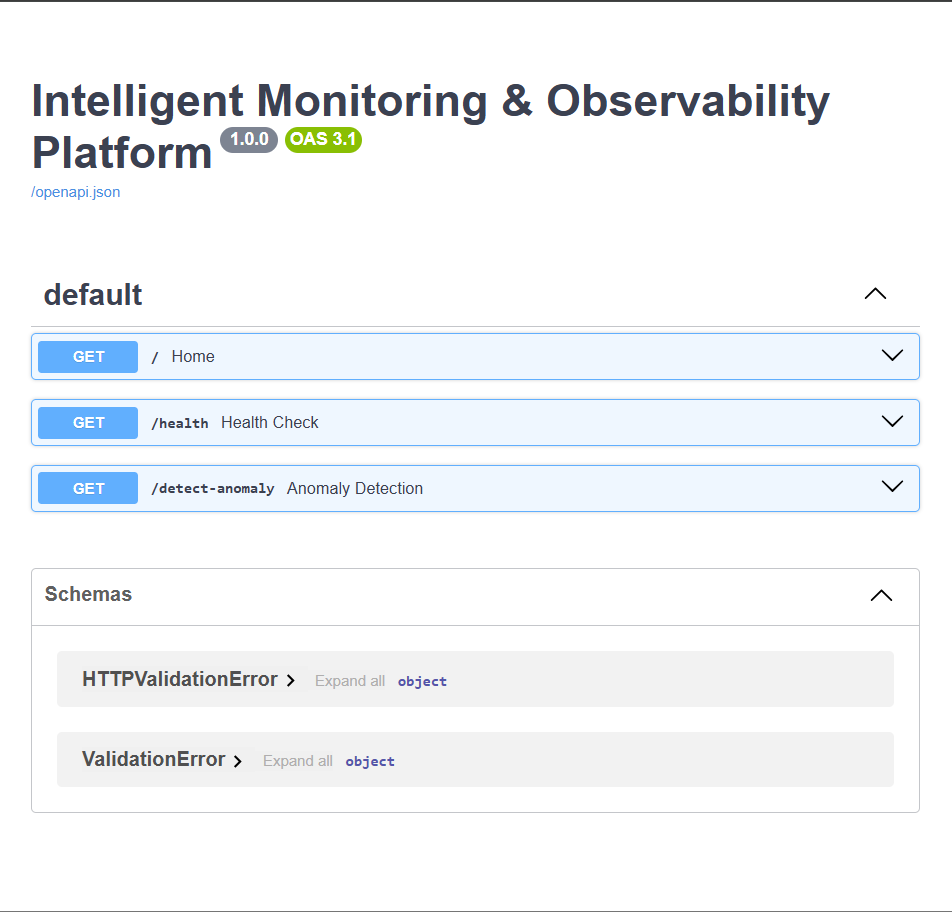
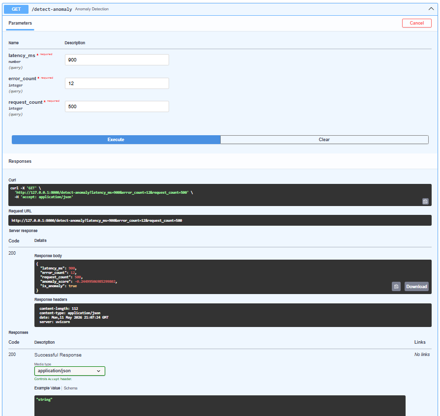
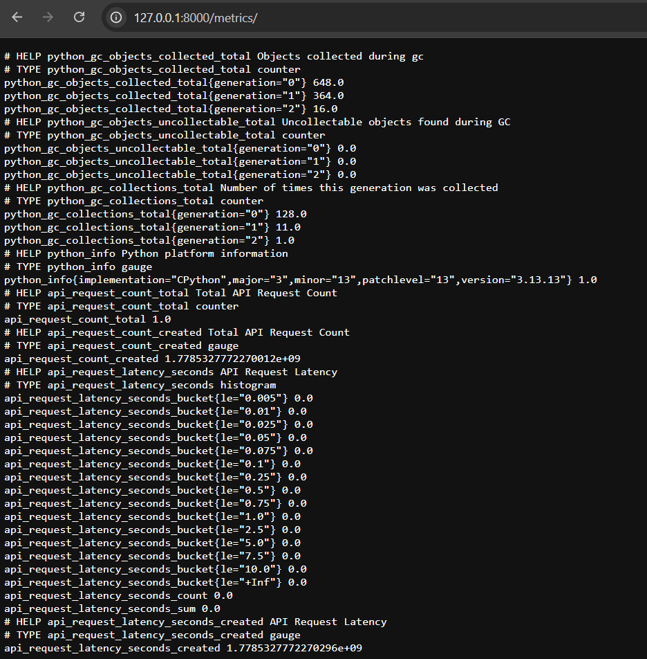

# Intelligent Monitoring & Observability Platform


A production-style backend monitoring platform for tracking API health, request metrics, latency signals, and anomaly patterns using FastAPI, Prometheus metrics, and machine learning based anomaly detection.

---

## Features

- FastAPI backend APIs
- API health monitoring
- Request latency tracking
- Prometheus metrics integration
- Machine learning based anomaly detection
- Dockerized deployment
- Structured logging
- Production-style backend architecture

---

## Tech Stack

- Python 3.13
- FastAPI
- Uvicorn
- Scikit-learn
- Prometheus Client
- Docker
- GitHub

---

## Project Structure

```text
intelligent-monitoring-observability-platform/
│
├── app/
│   ├── api/
│   │   ├── ml/
│   │   │   └── anomaly_detector.py
│   │   ├── monitoring/
│   │   │   └── metrics.py
│   │   └── routes.py
│   │
│   ├── utils/
│   │   └── logger.py
│   │
│   ├── __init__.py
│   └── main.py
│
├── tests/
│   └── test_health.py
│
├── Screenshots/
│   ├── api-docs.png
│   ├── anomaly-detection.png
│   └── metrics-endpoint.png
│
├── Dockerfile
├── docker-compose.yml
├── requirements.txt
├── README.md
└── .gitignore
```

---

## API Documentation

### Swagger API Docs



---

### Anomaly Detection Endpoint



---

### Prometheus Metrics Endpoint



---

## Available API Endpoints

| Method | Endpoint | Description |
|---|---|---|
| GET | `/` | Home endpoint |
| GET | `/health` | Health check |
| GET | `/detect-anomaly` | ML anomaly detection |
| GET | `/metrics` | Prometheus metrics |

---

## Running Locally

### Clone Repository

```bash
git clone https://github.com/koteshbabubommana/intelligent-monitoring-observability-platform.git
```

### Navigate to Project

```bash
cd intelligent-monitoring-observability-platform
```

### Install Dependencies

```bash
pip install -r requirements.txt
```

### Run Application

```bash
python -m uvicorn app.main:app --reload
```

---

## Open Swagger UI

```text
http://127.0.0.1:8000/docs
```

---

## Example Anomaly Detection Request

```text
GET /detect-anomaly?latency_ms=900&error_count=12&request_count=500
```

### Example Response

```json
{
  "latency_ms": 900.0,
  "error_count": 12,
  "request_count": 500,
  "anomaly_score": -0.244995,
  "is_anomaly": true
}
```

---

## Docker Support

### Build Docker Image

```bash
docker build -t intelligent-monitoring-platform .
```

### Run Docker Container

```bash
docker run -p 8000:8000 intelligent-monitoring-platform
```

---

## Monitoring Features

- Real-time API monitoring
- Request count tracking
- Latency monitoring
- Prometheus metrics exposure
- Structured backend logging
- Machine learning anomaly detection

---

## Future Improvements

- Grafana dashboard integration
- CI/CD GitHub Actions pipeline
- Cloud deployment on AWS/GCP
- Kubernetes deployment
- Advanced anomaly prediction models
- Alerting system integration

---

## Author

Kotesh Babu Bommana

GitHub: https://github.com/koteshbabubommana
LinkedIn: https://www.linkedin.com
